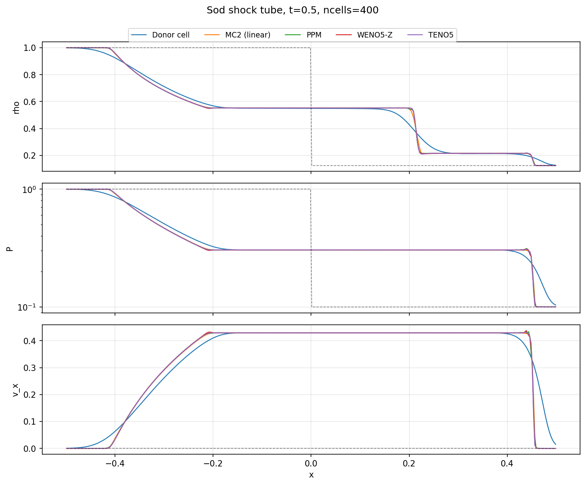

Hydro Driver
============

1+1D special-relativistic hydrodynamics driver for end-to-end testing
of reconstruction methods on shock-tube problems.

EOS (Equation of State)
-----------------------

.. automodule:: hydro_driver.eos
   :members:

SR-HD (Special-Relativistic Hydro)
----------------------------------

.. automodule:: hydro_driver.sr_hd
   :members:

Shock Tube
----------

.. automodule:: hydro_driver.shock_tube
   :members:
