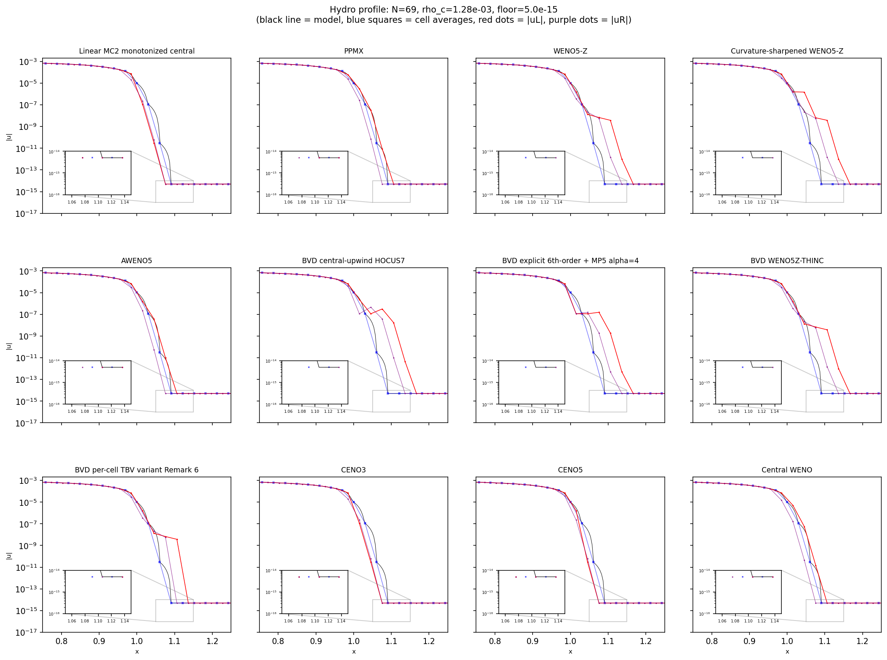

Overview
========

pyrecon is a library of spatial reconstruction methods for hyperbolic
conservation laws.  Given cell-centered values on a 1D stencil, each
method returns left and right face values at cell interfaces — the
inputs needed by Riemann solvers and numerical flux functions in
finite-volume and finite-difference codes.

The library provides 102 registered methods spanning over 20 method
families, all compiled to machine code via Numba JIT for use in
production simulation loops.

.. _overview_reconstruction_problem:

The reconstruction problem
--------------------------

A finite-volume scheme evolves cell-averaged values :math:`\bar{u}_i`.
At each time step the solver needs pointwise values on either side of
every cell interface — the *reconstructed states* — to feed a Riemann
solver or to compute fluxes directly:

.. math::

   u_{i+1/2}^- \quad\text{(left state, from cell }i\text{ looking right)}\\
   u_{i-1/2}^+ \quad\text{(right state, from cell }i\text{ looking left)}

A reconstruction method takes a stencil of cell-centered values
:math:`\{u_{i-r},\,\dots,\,u_{i+s}\}` and returns the pair
:math:`(u_{i+1/2}^-,\, u_{i-1/2}^+)`.

The challenge: high-order polynomials give accuracy in smooth regions
but produce spurious oscillations near shocks and discontinuities.
Each method family in pyrecon tackles this trade-off with a different
strategy — nonlinear weighting, adaptive stencil selection, hybrid
fallback, or entropy-stable reformulation.

.. _overview_conventions:

Conventions
-----------

Stencil arguments
   Every function accepts positional stencil arguments.  A 5-argument
   function expects ``(u_im2, u_im1, u_i, u_ip1, u_ip2)`` with the current
   cell at ``u_i``.  Wider stencils add more points outward.

Face convention
   All paired methods return ``(uL, uR)`` where:

   - ``uL`` = :math:`u_{i+1/2}^-` — left state at the right face of cell i
   - ``uR`` = :math:`u_{i-1/2}^+` — right state at the left face of cell i

   The shorthand "at i+1/2" in docstrings means the pair follows this
   convention throughout.

FV vs PW
   Method names end in ``_fv`` (finite-volume, cell-averaged stencil
   coefficients) or ``_pw`` (pointwise, direct interpolation).
   ``reconstruct_array`` dispatches both transparently.

.. _overview_registry:

Method registry
---------------

All methods are registered in :class:`pyrecon.interface._METHODS`.
Use :func:`~pyrecon.interface.list_methods` to enumerate them and
:func:`~pyrecon.interface.get_method` to retrieve a callable by name.

.. code-block:: python

   from pyrecon.interface import list_methods, get_method, reconstruct_array

   # List every method with its stencil width and description
   for name, sw, desc in list_methods():
       print(f"{name:30s} {sw}-pt  {desc}")

   # Reconstruct a full 1D array (automatically maps the stencil)
   z = [1., 2., 3., 4., 5., 6., 7., 8.]
   zl, zr = reconstruct_array("weno5z_fv", z)

   # Or call a method directly with explicit stencil arguments
   from pyrecon.recon_weno5 import weno5z_fv
   uL, uR = weno5z_fv(0.5, 1.0, 2.0, 3.0, 4.5)

Methods compiled with Numba JIT (``nopython=True``, ``cache=True``)
are drop-in ready for production simulation loops.

.. _overview_families:

Method families
---------------

WENO
~~~~

**Weighted Essentially Non-Oscillatory** schemes combine candidate
polynomials from overlapping sub-stencils using nonlinear weights
derived from smoothness indicators.  Smooth stencils get near-optimal
weights; stencils crossing discontinuities are suppressed.

Implemented variants:

* **WENO-JS** (Jiang & Shu 1996) — the original formulation with
  :math:`\omega_k \propto d_k / (\beta_k + \epsilon)^2`.
* **WENO-Z** (Borges et al. 2008) — adds a global smoothness indicator
  :math:`\tau_5 = |\beta_0 - \beta_2|` for improved accuracy at
  critical points.  Available for orders 3, 5, and 7.
* **WENO-Z+**, **WENO-Z-NS**, **WENO-ZC+**, **WENO-ZP**, **WENO-CZ** —
  variants with different :math:`\tau` formulations and exponent choices.
* **WENO-M** (mapped) — Henrick mapping function that pushes weights
  toward optimal values in smooth regions.
* **WENO-AO(5,3)** — adaptive-order WENO blending a 5th-order full
  stencil with 3rd-order small stencils.
* **WENO-C** — combined two-layer WENO with inter-layer JS weighting.
* **WENO-D-SI** — dispersion-relation-preserving variant.
* **WENO5-BC**, **WENO5-Ha-JS** — blended-centered and Ha-JS variants.

See: ``api/weno``

TENO
~~~~

**Targeted ENO** schemes (Fu et al. 2016) use a sharp cutoff
:math:`\chi_k \in \{0, 1\}` rather than continuous nonlinear weights.
Stencils that cross a discontinuity are completely discarded; only
smooth stencils participate in the reconstruction.

Implemented variants:

* **TENO5** — 5th-order with Takagi et al. (2022) simplified
  :math:`\tau = |\beta_1 - \beta_2|`.
* **TENO-A** — adaptive cutoff threshold :math:`C_T` derived from
  local smoothness.
* **TENO-M** — monotonicity-preserving with Van Albada, TVD5, and MP
  limiter options.
* **TENO Hybrid** — switches to MC2 fallback when a discontinuity
  indicator exceeds threshold.
* **TENO-THINC** — hybrid with THINC (algebraic interface capturing)
  near discontinuities.
* **CTENO5** — central-TENO with hard cutoff; **CTENO5Z** adds
  WENO-Z-inspired :math:`\tau`.
* **VHO-TENO8-AA**, **VHO-TENO10-AA** — very-high-order adaptive
  accuracy (pointwise only).

See: ``api/teno``

CWENO / CENO / CTENO
~~~~~~~~~~~~~~~~~~~~

**Central WENO** (Cravero et al. 2017) uses a single optimal polynomial
built from all stencil points, with nonlinear correction terms from
sub-stencils.  **CENO** selects the minimum-abs correction.
**CTENO** fuses central stencil construction with TENO-style cutoff.

Variants: CWENO3, CWENO5, CWENO3-Z, CWENO5-Z, CWENO5-Capdeville (2008),
Central WENO, CENO3, CENO5, CTENO5, CTENO5Z.

See: ``api/cweno``

MP (Monotonicity-Preserving)
~~~~~~~~~~~~~~~~~~~~~~~~~~~~

MP schemes (Suresh & Huynh 1997) apply a hard limiter to a high-order
candidate polynomial, constraining it within local monotonicity bounds.
Variants: **MP3**, **MP5**, **MP7**, **MP5-R** (ratio-based), and
**MP5-MP** (multi-phase, with 5% overshoot relaxation at interfaces).

See: ``api/mp``

PPM (Piecewise Parabolic Method)
~~~~~~~~~~~~~~~~~~~~~~~~~~~~~~~~

PPM (Colella & Woodward 1984) fits a parabola in each cell from the
cell average and neighboring values, then applies monotonicity
constraints.  **PPMX** is an extended variant with steeper
discontinuity capture.

See: ``api/ppm``

ES-WENO (Energy-Stable WENO)
~~~~~~~~~~~~~~~~~~~~~~~~~~~~~

Yamaleev & Carpenter (2009) energy-stable formulation with
:math:`p=1`.  Available for 3rd and 5th order.

See: ``api/entropy``

Entropy-stable scalar
~~~~~~~~~~~~~~~~~~~~~

Reconstruct in entropy variables :math:`v = \eta'(u)` for selected
entropy functions, then map back to conserved space.  Supported
entropies:

* :math:`\eta(u) = u^2/2` — quadratic
* :math:`\eta(u) = u \log u` — logarithmic (with pass-through for
  non-positive inputs)
* :math:`\eta(u) = u^4/4` — cubic

Available in both FV and PW variants.

See: ``api/entropy``

BVD (Boundary Variation Diminishing)
~~~~~~~~~~~~~~~~~~~~~~~~~~~~~~~~~~~~~

BVD schemes (Sun, Inaba & Xiao 2016; Chamarthi & Frankel 2021) select
between a high-order candidate (WENO5-Z or HOCUS6) and a
discontinuity-capturing candidate (THINC) by minimizing total boundary
variation at each interface.

Variants: **BVD** (WENO5-Z/THINC, 4-way per-interface), **BVD-TBV**
(per-cell Remark 6 variant), **BVD-CU** (HOCUS6 compact central-upwind
+ MP5), **BVD-E6-MP5** (explicit 6th-order central + MP5).

See: ``api/bvd``

THINC-BVD
~~~~~~~~~

Ratio-based switching between WENO5-Z and THINC.  When the
smoothness ratio :math:`\max\beta / \min\beta > 100`, the method uses
THINC; otherwise standard WENO5-Z.  FV and PW variants.

Hybrid
~~~~~~

Methods that switch between a high-order scheme in smooth regions and
a robust fallback near discontinuities:

* **Linear-WENO hybrids** — switch between linear (unlimited)
  reconstruction and WENO5-Z based on a discontinuity sensor with
  tunable sensitivity (:math:`C_\tau = 0.5, 1.0, 2.0`).
* **Hybrid MP5-MUSCL** — MP5 in smooth regions, MC2-limited MUSCL
  near extreme curvature.

See: ``api/hybrid``

Lagrange
~~~~~~~~

6th-order centered Lagrange polynomial interpolation.  Both ``uL``
and ``uR`` are the same centered value (both at :math:`i+1/2`),
differing from the standard paired convention.  FV and PW variants.

See: ``api/lagrange``

Other method families
~~~~~~~~~~~~~~~~~~~~~

.. list-table::
   :header-rows: 0

   * - **ROUND-A/B/C**
     - Unified low-dissipation framework (aggressive / balanced / smooth).
   * - **GENO5**
     - Gradient-based ENO, 5th-order with central-stencil boost.
   * - **ENO-MR3/5/7**
     - Multi-resolution ENO using hierarchical stencil decomposition.
   * - **AWENO5**
     - Alternative WENO formulation (Wang, Don & Wang 2023).
   * - **AD-WENO5**
     - Curvature-sharpened WENO5-Z with smoothness-gated anti-diffusion.
   * - **LS-WENO5-H**
     - Log-space WENO hybrid with sharp-feature fallback.
   * - **LS-WENO5-HP**
     - Physics-informed log-space WENO hybrid.
   * - **VHO-WENO9/11**
     - Very-high-order WENO using cascade of sub-stencil blends.
   * - **MOOD**
     - Multi-dimensional Optimal Order Detection (Clain, Diot & Loubère 2011).
   * - **Donor cell**
     - First-order piecewise-constant (reproduces :math:`u_i` at both faces).

See: ``api/misc``

.. _overview_jit:

Performance
-----------

All methods are compiled with Numba ``@jit(nopython=True, nogil=True,
cache=True)``.  The first call on a cold cache triggers compilation
(~100–500 ms); subsequent calls run at machine-code speed, suitable
for inner loops in production simulations.

Helper functions (minmod, MC2, smoothness indicators) are compiled
with ``inline='always'`` to eliminate call overhead.

To warm the JIT cache at import time, call the method once with dummy
data before entering a simulation loop.

.. _overview_visualization:

Visualization
-------------

Scripts in the ``viz/`` directory produce diagnostic plots from hydro
evolution and reconstruction error analysis on realistic density profiles
(loaded from GR-Athena++ tab output).

.. code-block:: bash

   # Shock-tube evolution profiles (written to figs/)
   python viz/run_sod.py     # Sod shock tube
   python viz/run_blast.py   # Blast wave
   python viz/run_collide.py # Colliding shocks

   # Reconstruction error analysis on NS surface profile
   python viz/ns_surface_profile.py    # FV methods
   python viz/ns_surface_profile_pw.py # PW methods

Sample data (``viz/sample_data/``) contains GR-Athena++ TOV-MHD tab
dumps at :math:`N = 128, 256, 512` resolution for surface profile
visualization.

.. _overview_install:

Installation
------------

Editable install (recommended for development):

.. code-block:: bash

   cd pyrecon/
   pip install -e .

Or add to ``PYTHONPATH``:

.. code-block:: bash

   export PYTHONPATH=$(pwd):${PYTHONPATH}

.. _overview_refs:

References
----------

A per-method paper reference list is maintained in ``REFS.md`` at the
repository root.  Each method's docstring also cites its primary
paper.
